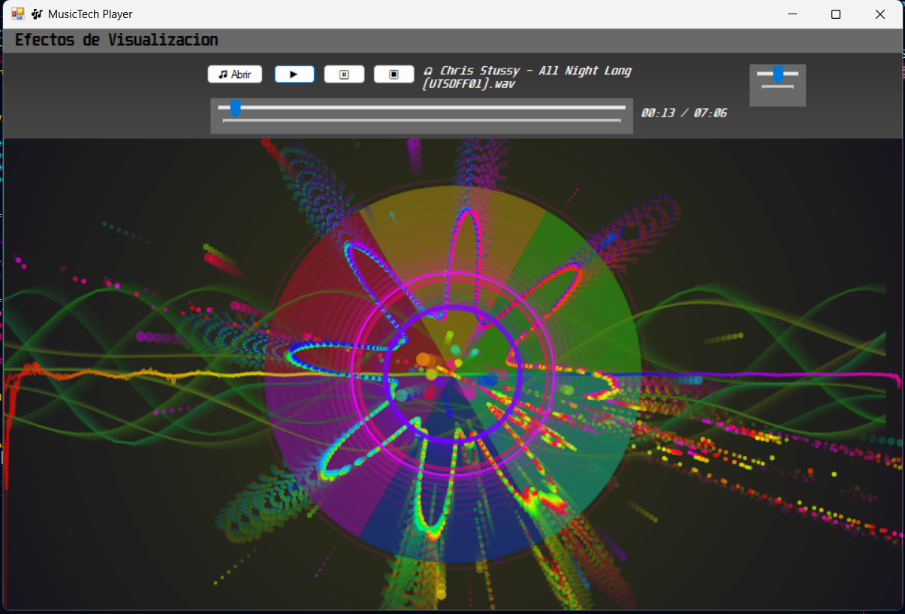
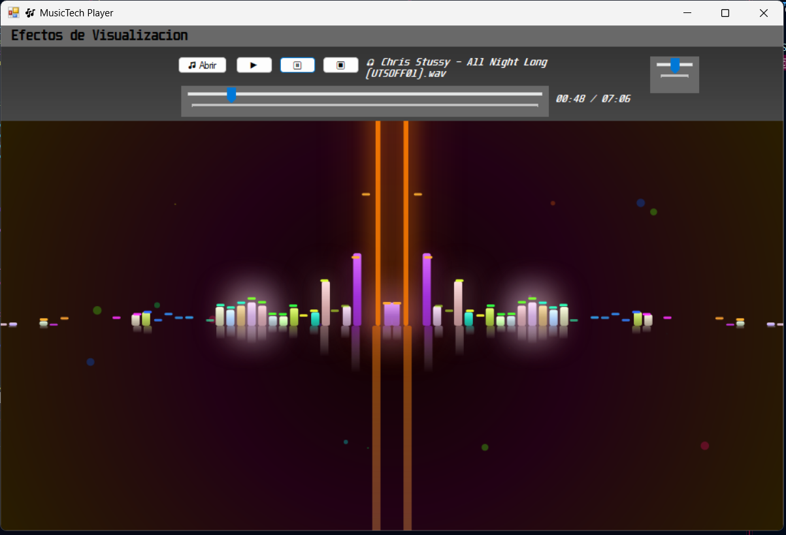
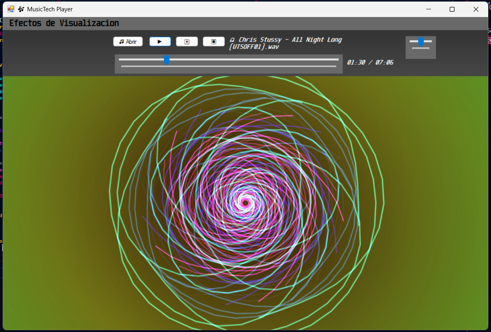

# 🎶 MusicTech Player

**MusicTech** es un reproductor de música avanzado en C# (.NET Framework) con visualizaciones psicodélicas en tiempo real basadas en la señal de audio. Utiliza **SkiaSharp** para gráficos acelerados y **NAudio** para el procesamiento del audio, ofreciendo una experiencia estética y reactiva al ritmo de la música.

---

## 🧩 Características principales

- 🎧 Reproductor de audio local (.mp3, .wav)
- 🎛 Controles: Play, Pause, Stop, Volumen, Barra de progreso
- 📜 Título de canción
- 🎨 Visualizaciones sincronizadas con el audio:
  - Efecto 1: Círculo con partículas dinámicas
  - Efecto 2: Espectro de barras verticales
  - Efecto 3: Fractal
  - Efecto 4: Conjunto de Mandelbrot animado
- 🖱 Selector de efecto desde menú desplegable

---

## 💻 Requisitos

- Visual Studio 2019/2022
- .NET Framework 4.7.2 o superior
- NuGet Packages:
  - [SkiaSharp.Views.Desktop](https://www.nuget.org/packages/SkiaSharp.Views.Desktop)
  - [NAudio](https://www.nuget.org/packages/NAudio)

---

## 📂 Estructura del proyecto

```
MusicTech/
├── Audio/
│   └── AudioAnalyzer.cs
├── Forms/
│   └── MainForm.cs
├── Rendering/
│   ├── VisualizerEngine.cs
│   ├── SpectrumWave.cs
│   ├── FractalEffect.cs
│   ├── Mandelbrot.cs
│   └── IVisualizer.cs
├── Utils/
│   ├── NativeMethods.cs
│   └── SampleAggregator.cs
```

---

## 🚀 Cómo ejecutar

1. Clona este repositorio:
   ```bash
   git clone https://github.com/tuusuario/MusicTech.git
   ```

2. Abre `MusicTech.sln` en Visual Studio.

3. Restaura los paquetes NuGet si es necesario:
   ```
   Herramientas > Administrador de paquetes NuGet > Restaurar paquetes
   ```

4. Ejecuta el proyecto (`F5`).

---

## 📸 Capturas

| Visualizador | Descripción |
|--------------|-------------|
|  | Círculo reactivo con partículas y fondo dinámico |
|  | Espectro con líneas de frecuencia animadas |
|  | Fractal psicodélico al ritmo de graves |
|  | Zoom fractal de Mandelbrot con colores vivos |

---

## 🧠 Créditos

Proyecto desarrollado con ❤️ por Elkin Pabon, Anabel Davila como parte del sistema de visualización interactiva en C#.

